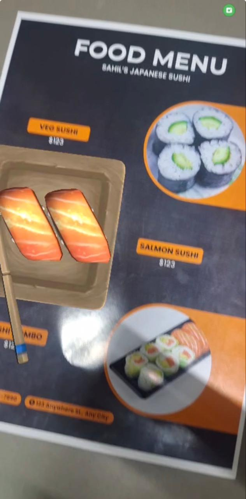
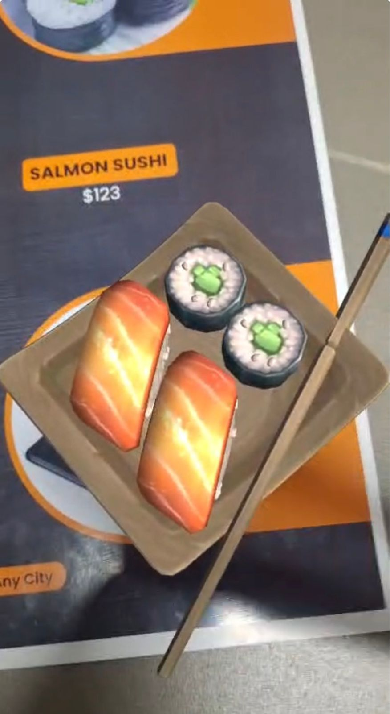
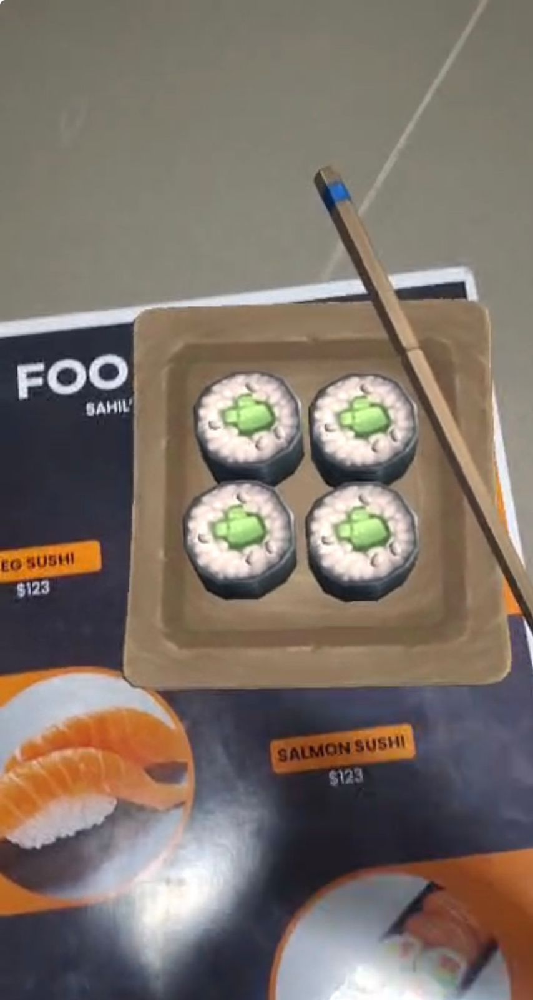
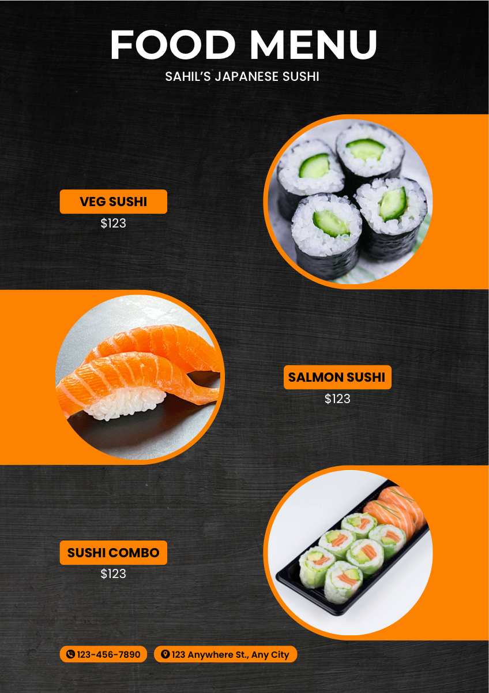

# SushiMenu

An augmented reality sushi menu built with Unity and Vuforia. Point your device camera at printed menu images to view interactive 3D sushi models overlaid on each dish.

---

## Demo

<div align="center">
  
</div>

---

## Screenshots

| Full menu | Salmon sushi | Veg sushi | Printable menu |
| :---: | :---: | :---: | :---: |
|  |  |  | [](Assets/Sahil%20Sushi%20Menu.pdf) |

Print [**Sahil Sushi Menu.pdf**](Assets/Sahil%20Sushi%20Menu.pdf), then point the app camera at the menu to see the 3D food models overlaid on each dish.

---

## Features

- **Image-target AR** — Vuforia tracks physical menu markers and anchors 3D content
- **Multiple menu items** — Salmon sushi, veg sushi, and sushi combo targets
- **Touch interaction** — Lean Touch plugin for mobile gestures
- **Android build** — Configured for deployment to Android devices

---

## Tech Stack

| | |
|---|---|
| **Engine** | Unity 6 (6000.0.66f2) |
| **AR** | Vuforia Engine 11.4.4 |
| **Input** | Unity Input System, Lean Touch |
| **UI** | TextMesh Pro |
| **Platform** | Android (primary) |

---

## Requirements

- [Unity Hub](https://unity.com/download) with **Unity 6000.0.66f2** (or compatible Unity 6 editor)
- **Vuforia Engine 11.4.4** — download from [PTC Developer Portal](https://developer.vuforia.com/) (not stored in git; see setup below)
- **Android device** with camera (for testing builds)
- Android SDK / build support module (install via Unity Hub)

---

## Getting Started

### 1. Clone the repository

```bash
git clone https://github.com/YOUR_USERNAME/SushiMenu.git
cd SushiMenu
```

### 2. Open in Unity

1. Open **Unity Hub** → **Add** → select the `SushiMenu` folder.
2. Use editor version **6000.0.66f2** when prompted.
3. Allow Unity to import assets and regenerate the `Library/` folder (this is normal and not committed to git).

### 3. Vuforia package (required after clone)

The Vuforia SDK is **not committed** (file size exceeds GitHub limits). After cloning:

1. Sign in at the [PTC Developer Portal](https://developer.vuforia.com/) and download **Vuforia Engine 11.4.4** for Unity.
2. Place the package file at:
   ```
   Packages/com.ptc.vuforia.engine-11.4.4.tgz
   ```
3. Reopen the project in Unity — it will resolve `com.ptc.vuforia.engine` from `Packages/manifest.json`.

Optional: copy the same `.tgz` to `Assets/Editor/Migration/` if Unity’s migration script prompts you.

### 4. Run in the Editor

1. Open **`Assets/Scenes/SampleScene.unity`** (main build scene).
2. Press **Play** to test in the Editor, or build to a device for full AR camera tracking.

---

## AR Image Targets

Tracking is configured in `Assets/StreamingAssets/Vuforia/menu.xml`:

| Target name | Marker image |
|---|---|
| `salmonsushi` | `Assets/my food/salmonsushi.jpg` |
| `vegsushi` | `Assets/my food/veg sushi.jpg` |
| `sushicombo` | `Assets/my food/sushi combo .jpg` |

Download and print [**Sahil Sushi Menu.pdf**](Assets/Sahil%20Sushi%20Menu.pdf) (or use the individual marker images below). Launch the app and point the camera at a target to see the associated 3D prefab.

---

## Building for Android

1. **File → Build Settings**
2. Select **Android** → **Switch Platform** (if needed)
3. Connect a device or use an emulator with camera support
4. **Build and Run**

Bundle ID: `com.SahilRoshan.SushiMenu`

---

## Project Structure

```
SushiMenu/
├── Assets/
│   ├── Scenes/              # Main scene (SampleScene)
│   ├── my food/             # Menu markers, prefabs, sushi assets
│   ├── StreamingAssets/     # Vuforia target database (menu.xml, menu.dat)
│   ├── JapaneseFood_Sushi Free/  # 3D sushi models (asset pack)
│   ├── Plugins/             # Lean Touch and shared plugins
│   └── Resources/
├── Packages/                # manifest.json + Vuforia .tgz
├── ProjectSettings/
└── docs/media/              # Screenshots & demo video (add your files here)
```

---

## Media Assets (for contributors)

When adding demo material, use this folder:

```
Assets/
├── img1.jpeg               # Veg sushi screenshot
├── img2.jpeg               # Full menu screenshot
├── img3.jpeg               # Salmon sushi screenshot
├── menu-preview.png        # Thumbnail of printable menu (README)
├── Sahil Sushi Menu.pdf    # Printable menu for AR scanning
docs/media/
└── screen_recording.gif    # Demo GIF (autoplays in README)
```

---

## License

_License TBD._

---

## Author

**Sahil Roshan** — [GitHub](https://github.com/YOUR_USERNAME)
